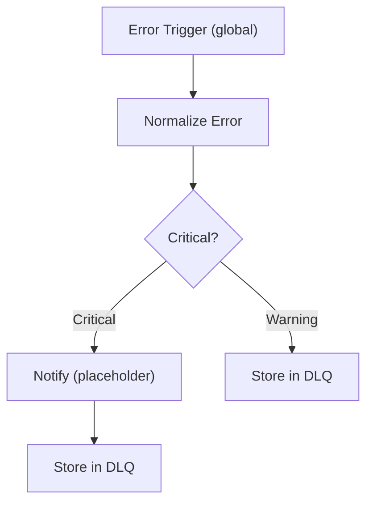

The Dead Letter Queue (DLQ) is a 5-node n8n workflow that acts as a safety net for the entire Bunker OS automation layer. Unlike a normal error handler scoped to a single workflow, the DLQ is configured as a **global error trigger** — it fires automatically whenever *any* workflow in the n8n instance fails. It normalizes the error, classifies severity, optionally sends a notification, and persists the failure to `staticData` for later review or replay. It ships as Inactive and must be activated before you run any other workflows.

## DLQ Pipeline



The pipeline is intentionally simple. Complexity lives in the Normalize and Classify nodes; the storage and notification paths are kept thin to minimize the risk of the DLQ itself failing.

## The 5 Nodes

### 1. Error Trigger

The entry point of the DLQ. This node is configured as a **global error trigger** in n8n, which means it receives error events from every other workflow in the instance — not just AOC v4 or the Health Check. When any workflow execution fails, n8n automatically fires this trigger with the full error context: workflow name, execution ID, error message, and stack trace.

### 2. Normalize Error

Extracts and structures the raw error payload into a consistent schema:

- Workflow name and ID
- Execution ID
- Error message and stack trace
- Timestamp
- Node name where the error occurred

Normalization ensures that downstream nodes (the classifier and store) work with a predictable shape regardless of which workflow originated the error.

### 3. Criticality Classifier

Inspects the normalized error and assigns a severity level:

| Severity | Trigger Conditions |
|---|---|
| **CRITICAL** | Authentication errors, permission errors, timeout errors |
| **WARNING** | All other failures |

CRITICAL errors route through the Notify node before storage, ensuring fast human awareness of auth failures or service outages. WARNING-level errors go directly to storage for batch review.

### 4. Notify (Placeholder)

For CRITICAL-severity errors, this node sends an alert before persisting the error to the DLQ. The node is shipped as a placeholder — wire it to the **Ultimate Alerter** webhook (`http://localhost:5678/webhook/ultimate-alerter`) to deliver notifications via Slack, Telegram, or Discord. See the [n8n Overview](/automation/n8n-overview) for Ultimate Alerter setup.

### 5. Store in DLQ

Persists the normalized error to the workflow's `staticData`. The DLQ retains the **last 200 errors** in a FIFO ring buffer — older entries are evicted when the limit is reached. The stored payload includes the full normalized error plus the severity classification and timestamp, giving you everything needed to reproduce and replay the failure.

## Severity Classification

The criticality classifier triggers CRITICAL severity for three error categories because they indicate systemic problems rather than transient failures:

- **Auth errors** — a service credential has expired, been revoked, or was never configured. The workflow will keep failing until the credential is fixed.
- **Permission errors** — the configured credential exists but lacks the required scope. Common with GitHub tokens missing `issues:write` or Slack tokens missing `chat:write`.
- **Timeout errors** — a downstream service (OpenRouter, GitHub API, Redis) is unreachable or responding too slowly. Often precedes an outage.

Everything else — malformed payloads, unexpected API response shapes, logic errors in workflow nodes — is classified as WARNING.

## Reviewing DLQ Errors

Access stored errors through the n8n UI:

1. Open the **Dead Letter Queue** workflow
2. Click **Executions** in the left sidebar
3. Each execution shows the full normalized error, severity classification, and the originating workflow

For bulk review, the `staticData` ring buffer is also accessible via the n8n API at:

```bash
GET http://localhost:5678/api/v1/workflows/{dlq-workflow-id}/static-data
```

## The Emergency Reprocessor

The DLQ captures errors. The **Emergency Reprocessor** acts on them. It is a companion workflow that runs on a schedule every 5 minutes, reads the DLQ's `staticData`, and attempts to re-execute failed events that were classified as CRITICAL. If the retry succeeds, the entry is removed from the DLQ buffer. If it fails again, it stays in the buffer and the next Emergency Reprocessor cycle will retry it again.

<Tip>
  Activate the **Dead Letter Queue** *before* activating **AOC v4 Enterprise** or any other advanced workflow. If AOC v4 fails during initial setup — missing credentials, misconfigured Redis, wrong webhook URL — the DLQ will capture every failure, classify it, and give you a clear error trail to debug from. Without the DLQ active, those errors are visible only in the n8n executions list and do not trigger notifications.
</Tip>

## Setup and Activation

<Note>
  The Dead Letter Queue ships as **Inactive**. An inactive DLQ does not catch errors — it must be toggled on to register the global error trigger. This is the first workflow you should activate after `docker compose up`.
</Note>

<Steps>
  <Step title="Import the DLQ workflow JSON">
    In n8n go to **Workflows → Import from file** and select the Dead Letter Queue JSON from `automation/n8n-lab/workflows/`. The workflow will appear as Inactive.
  </Step>

  <Step title="Wire the Notify node to Ultimate Alerter (optional but recommended)">
    Open the DLQ workflow. Find the **Notify** node and update its webhook URL to point at the Ultimate Alerter:

    ```
    http://localhost:5678/webhook/ultimate-alerter
    ```

    This routes CRITICAL error notifications through your existing Slack/Telegram/Discord channels without duplicating notification logic.
  </Step>

  <Step title="Activate the DLQ">
    Toggle the workflow to **Active** using the switch in the top-right of the workflow editor. The global error trigger is now registered. All future workflow failures in this n8n instance will be captured.
  </Step>

  <Step title="Verify with a test error">
    Trigger a deliberate failure in any other workflow (e.g., a misconfigured HTTP request node). Then check the DLQ executions — you should see a new execution with the normalized error and severity classification.
  </Step>
</Steps>

## Related Pages

<CardGroup cols={3}>
  <Card title="n8n Overview" icon="circle-nodes" href="/automation/n8n-overview">
    Full workflow inventory, infrastructure setup, and Docker compose.
  </Card>
  <Card title="AOC Pipeline" icon="diagram-project" href="/automation/aoc-pipeline">
    Activate the DLQ before AOC v4 to catch setup errors.
  </Card>
  <Card title="MCP Bridge" icon="plug" href="/automation/mcp-bridge">
    Connect OpenCode skills to n8n workflows via the MCP bridge.
  </Card>
</CardGroup>
