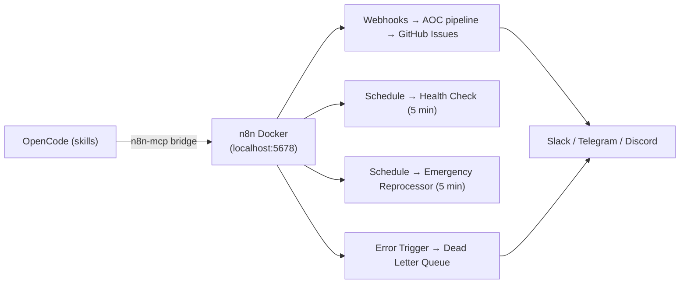

n8n is the async "nervous system" of Bunker OS. While OpenCode skills handle in-session intelligence — research, triage, wiki writes — n8n handles everything that happens *between* sessions: incoming webhooks, retries on failure, AI-assisted event routing, and fan-out notifications to Slack, Telegram, and Discord. It runs entirely on local Docker at `localhost:5678`, with no cloud dependency.

## Why n8n Instead of Bash

Bash scripts are fine for synchronous, single-step operations. The moment you need API keys, retries, conditional branching, or observability, they become fragile. n8n solves exactly those problems:

<CardGroup cols={2}>
  <Card title="Security" icon="lock" href="/operations/security">
    API keys (OpenRouter, Slack, Telegram, Discord, GitHub) live in the n8n credential vault — never in `.env` files or bash scripts committed to git.
  </Card>
  <Card title="Reliability" icon="rotate" href="/automation/dead-letter-queue">
    Built-in retry logic, a Dead Letter Queue for error capture, and an Emergency Reprocessor that auto-retries failed events every 5 minutes.
  </Card>
  <Card title="Complexity" icon="code-branch" href="/automation/aoc-pipeline">
    The AOC v4 Enterprise pipeline has 37 nodes with conditional branching, AI evaluation, and parallel notification delivery — none of which are practical in bash.
  </Card>
  <Card title="Observability" icon="chart-line" href="/concepts/architecture">
    Structured JSON logs, Prometheus-compatible metrics endpoint, and a full execution history UI at `localhost:5678`.
  </Card>
</CardGroup>

## Available Workflows

Bunker OS ships four n8n workflows. Two are active immediately after `docker compose up`; two require manual configuration and activation.

| Workflow | Nodes | Status | Description |
|---|:---:|---|---|
| Health Check | 2 | 🟢 Active | System health check every 5 min |
| Ultimate Alerter | 2 | 🟢 Active | Multi-channel alert via webhook |
| Dead Letter Queue | 5 | ⚪ Inactive | Error trigger: captures all workflow errors |
| AOC v4 Enterprise | 37 | ⚪ Inactive | Pipeline: webhook → AI triage → GitHub → ... |

<Note>
  **Health Check** and **Ultimate Alerter** activate automatically after `docker compose up`. **AOC v4 Enterprise** and **Dead Letter Queue** ship as Inactive and require manual credential configuration before activation.
</Note>

## Infrastructure Setup

All Docker configuration lives in `automation/n8n-lab/docker-compose.yml`. The recommended production setup pairs n8n with PostgreSQL (persistent execution data) and Redis (queue mode for horizontal scaling).

### Key Environment Variables

```yaml
N8N_CONCURRENCY_PRODUCTION_LIMIT=10   # Prevent OOM on traffic spikes
EXECUTIONS_DATA_PRUNE=true            # Auto-cleanup old execution records
N8N_METRICS=true                      # Prometheus-compatible metrics endpoint
N8N_LOG_FORMAT=json                   # Structured logs for log aggregation
```

These are set in `automation/n8n-lab/.env`. Adjust `N8N_CONCURRENCY_PRODUCTION_LIMIT` based on available RAM — 10 is a safe default for a local workstation.

<Warning>
  Store all API keys (OpenRouter, GitHub, Slack, Telegram, Discord) in the **n8n credential vault** — not in `.env` files. The `.env` file is gitignored but is still on disk. The n8n credential vault encrypts secrets at rest. The test suite actively scans for leaked API keys on every `make test` run.
</Warning>

## Async Automation Flow

The full signal path from OpenCode skill to notification delivery:



OpenCode skills trigger n8n via the MCP bridge. n8n handles everything downstream: webhook ingestion, AI triage via OpenRouter, GitHub issue creation, multi-channel notifications, and error capture via the Dead Letter Queue.

## Getting Started

<Steps>
  <Step title="Start n8n on Docker">
    ```bash
    cd automation/n8n-lab
    docker compose up -d
    ```

    n8n will start at `http://localhost:5678`. On first launch it will prompt you to create an admin account.
  </Step>

  <Step title="Verify Health Check and Ultimate Alerter are active">
    In the n8n UI, navigate to **Workflows**. You should see both **Health Check** and **Ultimate Alerter** with green active toggles. These ship pre-activated.
  </Step>

  <Step title="Configure credentials for AOC v4 and DLQ">
    Before activating the advanced workflows, add your credentials in **Settings → Credentials**:

    - **OpenRouter** — for AI triage in AOC v4
    - **GitHub** — for automated issue creation
    - **Discord / Slack / Telegram** — for multi-channel notifications
    - **Redis** — for the idempotency layer

    See the [AOC Pipeline](/automation/aoc-pipeline) and [Dead Letter Queue](/automation/dead-letter-queue) pages for per-workflow credential requirements.
  </Step>

  <Step title="Import workflow JSONs">
    Workflow definitions live in `automation/n8n-lab/workflows/`. Import each JSON via **Workflows → Import from file** in the n8n UI.
  </Step>

  <Step title="Connect OpenCode via MCP bridge">
    Configure the `n8n-mcp` server in `~/.config/opencode/opencode.json` so OpenCode skills can trigger n8n pipelines directly. See [MCP Bridge](/automation/mcp-bridge) for the exact config.
  </Step>
</Steps>

## Related Pages

<CardGroup cols={3}>
  <Card title="AOC Pipeline" icon="diagram-project" href="/automation/aoc-pipeline">
    37-node AI triage pipeline: webhook → OpenRouter → GitHub issues → notifications.
  </Card>
  <Card title="Dead Letter Queue" icon="triangle-exclamation" href="/automation/dead-letter-queue">
    Global error handler that catches failures from every workflow instance-wide.
  </Card>
  <Card title="MCP Bridge" icon="plug" href="/automation/mcp-bridge">
    Connect OpenCode skills to n8n so agents can trigger async pipelines.
  </Card>
</CardGroup>
