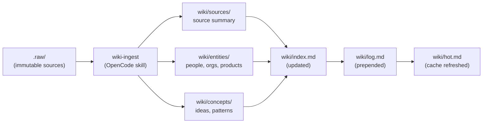
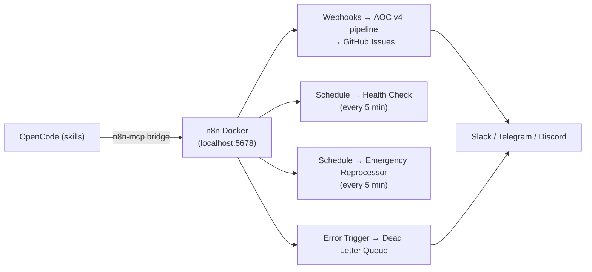
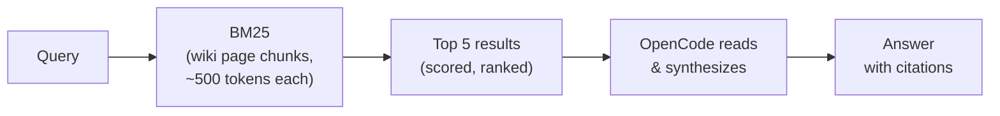

Bunker OS is not a traditional application — it is a local-first knowledge operating system built as a disciplined pipeline. Every piece of information that enters the system travels through exactly ten architectural layers before it becomes queryable, retrievable, and actionable. Understanding these layers helps you reason about where things live, what happens automatically, and how OpenCode remains the single intelligence that synthesizes answers from raw retrieval results.

## The 10 Layers

The architecture is designed so that each layer has a single responsibility. Capture feeds Normalize, Normalize feeds Classify, and so on down to Visualization. No layer reaches backwards.

```text
Capture       → wiki/inbox, .raw, ingest server, handovers
Normalize     → _templates, skills/wiki-ingest
Classify      → wiki/sources, entities, concepts, projects, comparisons
Evidence      → report.zip, security-audit-report.json, evidence index
Governance    → BUNKER_RULES, ADR template, knowledge supply chain
Automation    → bin/ (sync ops) + n8n (async flows, alerts, DLQ)
Retrieval     → BM25 index (pure Python, zero deps) + OpenCode synthesis
Testing       → 5 suites: workflows n8n, wiki integrity, scripts, YAML, retrieve
Agent Runtime → agents, commands, skills (13), hooks (7)
Visualization → dashboard, canvases, Obsidian graph
```

<CardGroup cols={2}>
  <Card title="Layer 1 — Capture" icon="inbox">
    Raw sources land in `.raw/` (immutable), `wiki/inbox/`, or arrive via the ingest server at `127.0.0.1:9090`. Handover files preserve cross-session context.
  </Card>
  <Card title="Layer 2 — Normalize" icon="wand-magic-sparkles">
    The `wiki-ingest` skill and `_templates/` directory transform raw content into structured Markdown pages with YAML frontmatter.
  </Card>
  <Card title="Layer 3 — Classify" icon="tags">
    Normalized content is routed to `wiki/sources/`, `wiki/entities/`, `wiki/concepts/`, `wiki/projects/`, or `wiki/comparisons/` based on content type.
  </Card>
  <Card title="Layer 4 — Evidence" icon="shield-check">
    Security artifacts (`report.zip`, `security-audit-report.json`) are indexed with SHA256 checksums via the `evidence-index` skill and `bin/evidence-index.sh`.
  </Card>
  <Card title="Layer 5 — Governance" icon="scale-balanced">
    `BUNKER_RULES.md` defines the ADR lifecycle, note quality standards (100+ lines for core concepts), and the knowledge supply chain.
  </Card>
  <Card title="Layer 6 — Automation" icon="robot">
    Synchronous operations run through `bin/` shell scripts. Asynchronous pipelines, alerts, and the Dead Letter Queue run through n8n on Docker.
  </Card>
  <Card title="Layer 7 — Retrieval" icon="magnifying-glass">
    BM25 (pure Python stdlib, zero external dependencies) indexes wiki pages into ~500-token chunks. OpenCode reads ranked results and synthesizes answers.
  </Card>
  <Card title="Layer 8 — Testing" icon="flask">
    Five test suites (344 n8n connection tests, 21 vault integrity tests, 61 script tests, 2 YAML tests, 2 BM25 tests) run via `make test` and GitHub Actions CI.
  </Card>
  <Card title="Layer 9 — Agent Runtime" icon="microchip">
    13 bundled OpenCode skills, slash command definitions, 3 agent instruction files, and 7 hooks across 4 lifecycle events.
  </Card>
  <Card title="Layer 10 — Visualization" icon="chart-bar">
    The `wiki/meta/dashboard.md` command center, Obsidian canvases, and the Obsidian graph view provide a visual command layer over the entire knowledge base.
  </Card>
</CardGroup>

## Vault Flow

The simplest path through the system is a single source being ingested. `.raw/` holds the immutable original. The `wiki-ingest` OpenCode skill reads it, extracts entities and concepts, creates cross-referenced pages, and files them into `wiki/`.



The `.raw/` directory is never modified after initial placement. It is the immutable record of truth. All derived pages in `wiki/` are regenerable from it.

## Async Automation Flow

The automation layer separates synchronous operations (scripts that run inline in your terminal) from asynchronous operations (pipelines that run in the background via n8n on Docker). This separation keeps bash scripts clean and free of API credentials — those live exclusively in the n8n credential vault.



OpenCode triggers n8n pipelines through the `n8n-mcp` bridge. This gives the agent "hands" to launch complex async workflows — AI triage, GitHub issue creation, multi-channel notifications — without embedding secrets in any script.

## Sync vs Async Operations

Understanding which layer handles which type of work prevents confusion about where to look when something goes wrong.

| Operation | Layer | Entry Point |
|---|---|---|
| Vault integrity scan | Sync (`bin/`) | `./bin/wiki-integrity.sh` |
| Evidence indexing | Sync (`bin/`) | `./bin/evidence-index.sh` |
| BM25 index rebuild | Sync (`scripts/`) | `python3 scripts/retrieve.py build` |
| Full health check | Sync (`bin/`) | `./bin/bunker-check.sh` |
| AI triage pipeline | Async (n8n) | webhook → AOC v4 |
| Multi-channel alerts | Async (n8n) | Ultimate Alerter workflow |
| Error capture | Async (n8n) | Dead Letter Queue trigger |
| Health monitoring | Async (n8n) | Health Check workflow (5-min schedule) |

## The Retrieval Design Principle

BM25 is the retrieval engine. OpenCode is the intelligence engine. These two roles are strictly separated. BM25 returns ranked wiki page chunks — it does no understanding, no embedding, no LLM inference. OpenCode reads those ranked chunks and synthesizes the answer. The agent is always in the loop for interpretation.



This design means the BM25 index is a pure Python stdlib artifact — no numpy, no ollama, no API keys. It can be rebuilt from scratch at any time with `python3 scripts/retrieve.py build`. Retrieval is fast and offline; synthesis requires the model.

<Note>
  All data in Bunker OS is local-first by design. The vault is a plain folder of Markdown files on your disk. The BM25 index is a local JSON file. n8n runs on Docker on your machine. No page, chunk, or session state is sent to any cloud service as part of core functionality. Optional integrations (Exa for autoresearch, OpenRouter for AI triage, notification webhooks) remain opt-in and are configured only if you choose to add them.
</Note>

## Related

<CardGroup cols={2}>
  <Card title="Vault Structure" href="concepts/vault-structure" icon="folder-open">
    Directory layout, special files, and the classification system.
  </Card>
  <Card title="Knowledge Lifecycle" href="concepts/knowledge-lifecycle" icon="arrow-rotate-right">
    How a raw source becomes a cross-referenced wiki page.
  </Card>
  <Card title="BM25 Retrieval" href="operations/bm25-retrieval" icon="magnifying-glass">
    How the zero-dependency text retrieval system works.
  </Card>
  <Card title="n8n Automation" href="automation/n8n-overview" icon="robot">
    The async nervous system: workflows, DLQ, and AOC v4.
  </Card>
</CardGroup>
