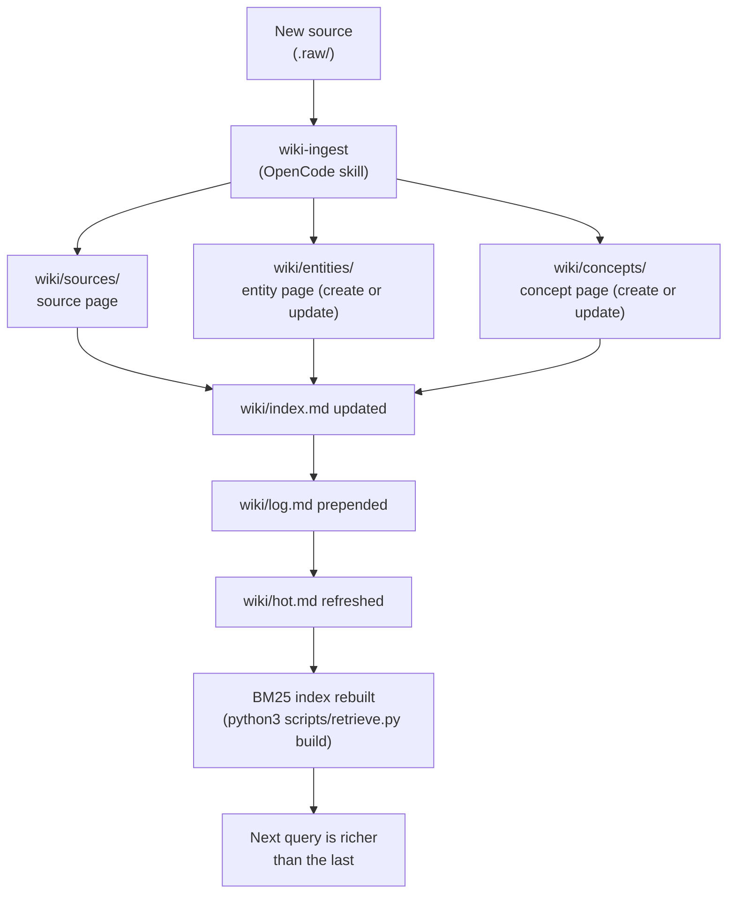

The central design principle of Bunker OS comes from the LLM Wiki Pattern introduced by Andrej Karpathy: **the wiki is the product, chat is just the interface.** Most AI assistant workflows treat every session as a blank slate — you ask a question, the model answers from training data, and nothing persists. Bunker OS inverts this. Every source you ingest, every question you ask, every research loop you run produces a durable wiki artifact that enriches every future query. Knowledge compounds like interest.

## Why Compounding Works

The difference between Bunker OS and a RAG (retrieval-augmented generation) system is the nature of what gets stored. A RAG pipeline stores raw chunks — fragments of documents sliced at token boundaries, with no awareness of each other. When you query, you get chunks back and the model tries to make sense of them in isolation.

Bunker OS stores **processed wiki pages**. By the time a source lands in `wiki/`, an agent has already:

- Extracted the key entities (people, organizations, products)
- Identified the concepts and patterns
- Checked for contradictions with existing pages and flagged them
- Added wikilinks connecting the new page to related existing pages
- Recorded the source in `wiki/index.md` so it appears in every future navigation pass

When you query later, the cross-references are already resolved. The synthesis work has already been done once. The agent reads pages that already know about each other, not isolated chunks that must be re-assembled on every query.

<Tip>
  The read order for any query is optimized for token efficiency. Start with `wiki/hot.md` (~500 words, recent context). If that is not enough, read `wiki/index.md` (the catalog of everything). Only then drill into specific pages. This three-step protocol means most questions are answered within the first two reads without crawling the full vault.
</Tip>

## The Ingestion Workflow

Every time a new resource is provided — a URL, a file, a document dropped in `.raw/` — the same six-step ingestion workflow runs. These steps are not optional. Skipping any of them breaks the compounding: a page that is not in the index is invisible to future queries; a page that is not in the log has no audit trail.

<Steps>
  <Step title="Create source page in wiki/sources/">
    Write a full summary page at `wiki/sources/[slug].md` with complete frontmatter: `type: source`, `source_type`, `author`, `date_published`, `url`, `confidence`. Read the source completely — do not skim. The summary page is the permanent record of what was in the document at time of ingestion.
  </Step>
  <Step title="Create entity page in wiki/entities/">
    For every person, organization, product, or repository mentioned significantly in the source, create or update a page in `wiki/entities/`. Entity pages track what is known about that entity across all sources — they accumulate knowledge from every ingest that touches them.
  </Step>
  <Step title="Create concept page in correct folder">
    For every idea, pattern, or framework introduced by the source, create or update a concept page. Technical concepts with inline code examples go in `wiki/concepts/tech-stack/`. General concepts, patterns, and mental models go in `wiki/concepts/`. The correct folder is not cosmetic — the lint check uses it to validate vault health.
  </Step>
  <Step title="Update wiki/index.md">
    Append entries for every new page created. The index is the vault's navigation layer. If a page is not in the index, it is effectively invisible — it will never surface during the standard read order and will only be found by an explicit BM25 search. Never skip the index update.
  </Step>
  <Step title="Prepend to wiki/log.md">
    Add a dated log entry at the **top** of `wiki/log.md` (newest first). The log entry records: the source file, the pages created, the pages updated, and one sentence describing the key insight. The log is the chronological audit trail of the vault's growth.
  </Step>
  <Step title="Check for contradictions with existing pages">
    After all pages are written, scan existing wiki pages for claims that conflict with the new source. If contradictions are found, add `> [!contradiction]` callout blocks on **both** the existing page and the new page. Do not silently overwrite claims — flag them and let the owner decide. Unresolved contradictions appear in the `wiki-lint` health check.
  </Step>
</Steps>

## The Query Read Order

When answering a question, the system follows a deterministic read order designed to minimize token consumption while maximizing recall:

```
1. wiki/hot.md           (~500 words, recent context — covers most recent work)
2. latest handover       (wiki/meta/handovers/ — cross-session state)
3. wiki/index.md         (master catalog — find which pages are relevant)
4. specific pages        (only the pages identified in step 3)
```

If the BM25 index is available, step 3 is replaced by a ranked keyword search:

```bash
python3 scripts/retrieve.py "your query here" --top 5
```

BM25 returns the top 5 wiki page chunks scored by term frequency. OpenCode reads those chunks and synthesizes an answer with citations. The retrieval step is pure Python stdlib — no API call, no embedding model, no internet required.

## Evidence Preservation

For security audits and compliance workflows, Bunker OS maintains an evidence layer that sits above normal wiki pages. Evidence artifacts (`report.zip`, `security-audit-report.json`) are indexed with SHA256 checksums via `bin/evidence-index.sh` and the `evidence-index` skill.

```bash
# Index evidence artifacts
./bin/evidence-index.sh

# The indexed manifest records:
# - file path
# - SHA256 checksum
# - timestamp
# - metadata extracted from the artifact
```

Evidence artifacts are **indexed, not modified**. The original files remain bit-for-bit identical to what was captured. The index is the queryable layer; the originals are the tamper-evident record.

## Governance and Note Quality

The `BUNKER_RULES.md` governance document sets the quality floor for every wiki page. Key standards:

- **Core concept pages must be 100+ lines.** Seed notes (stubs with only a title and one sentence) are a governance violation. If a concept is worth tracking, it is worth explaining fully.
- **Every new note must be linked from `wiki/index.md` or a parent concept page.** Orphaned pages are flagged by `wiki-lint`.
- **All architectural decisions must be documented as ADRs** (Architecture Decision Records) in `wiki/decisions/` following the ADR lifecycle template.
- **Contradictions must be flagged with `[!contradiction]` callouts**, never silently resolved.

The `wiki-lint` health check (`lint the wiki` in OpenCode, or `./bin/wiki-integrity.sh` in the shell) validates all of these standards across 8 categories: orphans, dead links, short notes, missing frontmatter, stale contradiction markers, unlinked sources, and broken cross-references.

## How Knowledge Compounds Over Time

The compounding effect becomes visible after 20–30 ingests. At that point, new sources rarely introduce entirely new concepts — they extend, contradict, or confirm existing pages. The `wiki-ingest` skill finds the existing entity or concept page and adds a new section or updates the claims rather than creating a duplicate. Each ingest makes the next query more accurate without growing token consumption proportionally.



Every source that passes through this pipeline leaves a richer vault than it found. That is the compounding property: the value of the next ingest is higher than the value of the previous one, because each new page is immediately cross-referenced against everything that already exists.

## Related

<CardGroup cols={2}>
  <Card title="Vault Structure" href="concepts/vault-structure" icon="folder-open">
    The directory layout and classification system for all wiki content.
  </Card>
  <Card title="Architecture" href="concepts/architecture" icon="layer-group">
    How all 10 layers fit together to form the full pipeline.
  </Card>
  <Card title="BM25 Retrieval" href="operations/bm25-retrieval" icon="magnifying-glass">
    How the zero-dependency retrieval system indexes and ranks wiki pages.
  </Card>
  <Card title="Skills Overview" href="skills/overview" icon="wand-magic-sparkles">
    The 13 bundled skills that drive ingestion, querying, and maintenance.
  </Card>
</CardGroup>
