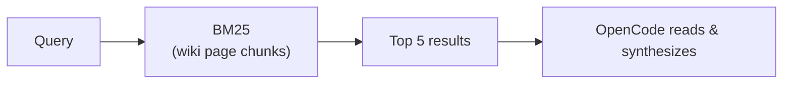

Bunker OS ships a complete text retrieval system built on BM25 — the same probabilistic ranking algorithm behind Elasticsearch and Lucene. It runs entirely on Python's standard library, requires no API keys, needs no network access, and imposes zero external dependencies. You can index your entire wiki and search it offline in milliseconds.

## What BM25 Is

BM25 (Best Match 25) is a sparse keyword retrieval algorithm. It scores documents by how well their term frequencies match a query, adjusted for document length and corpus-wide inverse document frequency. Unlike embedding-based retrieval, BM25 never needs a model inference step: it scores mathematically from a pre-built inverted index.

The Bunker implementation uses BM25 parameters `k1 = 1.5` and `b = 0.75` — the standard defaults used by most production search engines.

## Why BM25, Not Embeddings

<CardGroup cols={2}>
  <Card title="Zero Dependencies" icon="package">
    Pure Python 3.10+ stdlib. No numpy, no torch, no sentence-transformers, no API keys.
  </Card>
  <Card title="Fully Offline" icon="wifi-slash">
    The index lives at `.vault-meta/bm25/index.json`. Search works with no network access.
  </Card>
  <Card title="No Latency" icon="bolt">
    Index queries run in local memory. No round-trip to any embedding API or inference server.
  </Card>
  <Card title="Agent Synthesizes" icon="brain">
    OpenCode is the only intelligence. BM25 returns ranked text chunks; the agent reads and synthesizes answers.
  </Card>
</CardGroup>

## Retrieval Pipeline

The query never reaches an LLM for ranking. BM25 handles retrieval; OpenCode handles reasoning.



**The key principle**: BM25 returns ranked chunks. OpenCode is the only intelligence in the loop — it reads those chunks and synthesizes the answer.

## Performance Characteristics

| Metric | Value |
|---|---|
| Chunk size | ~500 tokens at paragraph boundaries |
| Seed vault pages | 8 (grows with every ingested source) |
| Index format | `.vault-meta/bm25/index.json` |
| Chunks directory | `.vault-meta/chunks/` |
| Runtime dependencies | Python 3.10+ stdlib only |
| BM25 k1 | 1.5 |
| BM25 b | 0.75 |

## CLI Usage

All retrieval operations go through `scripts/retrieve.py`:

```bash
# Build or rebuild the index
python3 scripts/retrieve.py build

# Check index status (pages, chunks, vocabulary size)
python3 scripts/retrieve.py status

# Search — returns top 5 by default
python3 scripts/retrieve.py "n8n docker automation" --top 5

# Custom top-k
python3 scripts/retrieve.py "BM25 retrieval" --top 3
```

<Tip>
Rebuild the index after adding new wiki pages or ingesting new sources. The index is not updated automatically — run `python3 scripts/retrieve.py build` to pick up new content.
</Tip>

## Output Format

`retrieve.py` emits JSON to stdout. OpenCode reads this output and synthesizes an answer from the ranked chunks:

```json
{
  "query": "n8n docker automation",
  "strategy": "bm25",
  "top_k": 3,
  "candidates": [
    {
      "doc_id": "doc_4",
      "score": 3.8271,
      "path": "wiki/concepts/n8n-architecture.md",
      "chunk": 0,
      "preview": "n8n runs on Docker and exposes an MCP bridge for OpenCode. The automation lab..."
    },
    {
      "doc_id": "doc_11",
      "score": 2.1043,
      "path": "wiki/concepts/docker-compose.md",
      "chunk": 1,
      "preview": "docker-compose.yml configures the n8n container with PostgreSQL..."
    }
  ]
}
```

Fields per candidate:

| Field | Description |
|---|---|
| `doc_id` | Internal document identifier |
| `score` | BM25 relevance score (higher is more relevant) |
| `path` | Repo-relative path to the source wiki page |
| `chunk` | Chunk index within the page (0-based) |
| `preview` | First 200 characters of the chunk text |

## Environment Variables

By default `retrieve.py` uses the repo root as the vault. Override it for cross-project use:

```bash
# Point at a different vault
export BUNKER_HOME="/path/to/opencode-obsidian"
python3 scripts/retrieve.py "query"

# Alternative variable name
export VAULT_PATH="/path/to/opencode-obsidian"
python3 scripts/retrieve.py "query"
```

Both `BUNKER_HOME` and `VAULT_PATH` are supported. `BUNKER_HOME` takes precedence.

## Indexer Internals (bm25-index.py)

The indexer in `scripts/bm25-index.py` handles three operations: `build`, `query`, and `status`.

### Chunking Strategy

Pages are chunked at **paragraph boundaries** (double newlines) with a target of **500 tokens per chunk**:

```python
# Simplified chunking logic from bm25-index.py
for p in paragraphs:
    tokens = len(tokenize(p))
    if current_len + tokens > 500 and current:
        chunks.append('\n\n'.join(current))
        current = []
        current_len = 0
    current.append(p)
    current_len += tokens
```

YAML frontmatter is stripped before chunking. If a page produces no chunks, the first 2000 characters are used as a fallback.

### Tokenization

```python
def tokenize(text):
    text = re.sub(r'[^a-záéíóúñüA-ZÁÉÍÓÚÑÜ0-9\s-]', ' ', text.lower())
    return [t for t in text.split() if len(t) > 1]
```

The tokenizer lowercases text, retains alphanumerics and hyphens (including accented Spanish characters), and drops single-character tokens.

### BM25 Scoring

For each query term `qt` across each document `doc_id`:

```
idf = log((N - df(qt) + 0.5) / (df(qt) + 0.5) + 1)
score += idf × (tf(qt) × (k1 + 1)) / (tf(qt) + k1 × (1 - b + b × dl / avgdl))
```

Where `N` is total chunk count, `df(qt)` is document frequency of the term, `dl` is the chunk length, and `avgdl` is the average chunk length across the corpus.

### Index Layout

```
.vault-meta/
├── bm25/
│   └── index.json        # Full BM25 index: N, avgdl, term_doc_freq, doc_terms, chunks, stats
└── chunks/               # (reserved for future chunk storage)
```

The `index.json` contains:
- `N` — total chunk count
- `avgdl` — average document length in tokens
- `term_doc_freq` — mapping of term → number of chunks containing it
- `doc_terms` — mapping of doc_id → term frequency map
- `chunks` — array of chunk metadata (path, chunk index, preview)
- `stats` — total pages, chunks, and vocabulary size

### What Gets Indexed

The indexer scans `wiki/**/*.md` recursively but **excludes** `wiki/meta/` to avoid indexing integrity reports and manifests.

## When to Use BM25 vs Autoresearch

| Scenario | Use |
|---|---|
| "What do we know about X?" — topic already in the wiki | BM25 (`retrieve`) |
| "How does the AOC pipeline work?" — documented concept | BM25 (`retrieve`) |
| "What is the latest on quantum computing?" — new topic | Autoresearch |
| "Find all pages mentioning n8n webhooks" | BM25 (`retrieve`) |
| "Research and file a summary of SLSA Level 2" | Autoresearch → then BM25 after ingestion |

BM25 is fast and free. Autoresearch uses web credits and takes multiple rounds. Use BM25 first — if the wiki already has the answer, you are done.

## Validate with make test-retrieve

The test suite includes a two-test BM25 suite:

```bash
make test-retrieve
```

```
========================================
  Suite: BM25 Retrieval
========================================
  ✅ Índice BM25 existe
  ✅ Búsqueda BM25 funciona
```

Test 1 checks that `index.json` exists (via `retrieve.py status`). Test 2 runs a test query and confirms results are returned.

## Related Pages

<CardGroup cols={2}>
  <Card title="CLI Scripts" href="operations/cli-scripts" icon="terminal">
    Shell scripts that complement the Python retrieval toolchain.
  </Card>
  <Card title="Testing" href="operations/testing" icon="flask">
    The full test suite including the BM25 retrieval suite.
  </Card>
  <Card title="Wiki Ingest" href="skills/wiki-ingest" icon="file-import">
    How sources get ingested into the wiki that BM25 indexes.
  </Card>
  <Card title="Wiki Query" href="skills/wiki-query" icon="magnifying-glass">
    The OpenCode skill that uses BM25 results to synthesize answers.
  </Card>
</CardGroup>
