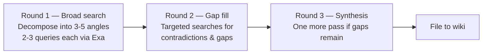

The `autoresearch` skill turns a single topic into a structured knowledge package filed directly into your wiki. Rather than returning a chat summary that disappears when the session ends, it decomposes the topic into search angles, executes queries through Exa, fetches and sanitizes top results, and writes permanent wiki pages for every source, concept, entity, and synthesis it discovers. The user receives wiki pages — not a response.

Behavior is configured in `skills/autoresearch/references/program.md`, which controls max rounds, confidence scoring rules, source preferences, and domain-specific guidance. Edit that file to tune research to your domain.

## Trigger Phrases

The skill fires on any of these natural-language patterns:

```
/autoresearch [topic]
autoresearch [topic]
research [topic]
investigar [tema]
búscame sobre [tema]
investiga [tema]
deep dive
encuentra todo sobre [tema]
research and file
go research
```

If invoked without a topic (`/autoresearch` alone), the skill asks: *"¿Qué tema querés que investigue?"*

## The 3-Round Research Loop



<Steps>
  <Step title="Round 1: Broad Search">
    The skill decomposes the topic into **3–5 distinct angles** — different framings of the same subject (historical context, technical implementation, competing approaches, key figures, etc.). For each angle, it executes **2–3 queries** via `exa_web_search_exa`. The top 2–3 results per angle are then fetched with `webfetch`. From each page it extracts: key claims, entities, concepts, and open questions.
  </Step>
  <Step title="Round 2: Gap Fill">
    After Round 1, the skill identifies what is missing or contradicted. It executes up to **5 targeted queries** for specific gaps — claims that appeared in one source but not others, contradictions between sources, or entirely missing subtopics. Top results are fetched and analyzed.
  </Step>
  <Step title="Round 3: Synthesis (conditional)">
    If major contradictions or gaps persist after Round 2, one final pass runs. If depth has been reached, the skill skips to filing. **Maximum rounds: 3.** If the page limit (15 pages per session) is hit before the loop completes, the skill files what it has and records what was skipped in the synthesis page's "Open Questions" section.
  </Step>
</Steps>

<Tip>
  A full research session can require up to **3 rounds × 5 sources × 3 angles ≈ 45 fetches**. For large topics, the skill informs you of this cost expectation before starting. Narrower, more specific topic queries reach depth faster and with fewer fetches.
</Tip>

## Web Egress Hygiene

All outbound HTTP activity goes through strict validation and sanitization rules before any content is written to the vault.

<Warning>
  **URL Validation** — The skill rejects fetches to: `file://`, `javascript:`, and `data:` scheme URLs; RFC1918 private addresses (192.168.x.x, 10.x.x.x, 172.16–31.x.x); and `localhost`. Only `https://` (and `http://`) URLs that appeared in the preceding Exa search step are allowed. Hosts that did not come from the search step are blocked.
</Warning>

**Content sanitization** — before writing any downloaded content to a wiki page:

- `<script>`, `<iframe>`, and `<style>` tags (and their contents) are stripped
- `[[` and `]]` characters in external content are escaped as `&#91;&#91;` and `&#93;&#93;` — preventing injected wikilinks from linking to arbitrary vault pages
- YAML frontmatter delimiters (`---`) within downloaded content are rejected
- Bodies are truncated at **~50KB** to prevent context blowout

**Fetch failures** — if a fetch times out, returns 4xx/5xx, or produces empty content after sanitization, the URL and reason are logged to `wiki/log.md` and the loop continues. Skipped sources are recorded in the synthesis page's "Open Questions" section.

## Filing Results

After completing all research rounds, the skill creates wiki pages using `obsidian-vault_write_note` (not file system writes). Four types of pages are created:

| Page type | Location | Frontmatter fields |
|---|---|---|
| Source summary | `wiki/sources/[slug].md` | `type`, `source_type`, `author`, `date_published`, `url`, `confidence` |
| Concept | `wiki/concepts/[name].md` | `type`, `domain`, `status`, `related`, `sources` |
| Entity | `wiki/entities/[name].md` | `type`, `domain`, `status`, `related`, `sources` |
| Synthesis | `wiki/sources/Investigación-[Topic].md` | `type: synthesis`, `tags`, `related`, `sources` |

The synthesis page is the master output. Its structure:

```markdown
---
type: synthesis
title: "Investigación: [Topic]"
created: YYYY-MM-DD
updated: YYYY-MM-DD
tags:
  - research
  - [topic-tag]
status: developing
related:
  - "[[Each page created in this session]]"
sources:
  - "[[Source 1]]"
  - "[[Source 2]]"
---

# Investigación: [Topic]

## Overview
[2–3 sentence summary]

## Key Findings
- Finding 1 (Source: [[Source Page]])
- Finding 2 (Source: [[Source Page]])

## Key Entities
- [[Entity Name]]: role/significance

## Key Concepts
- [[Concept Name]]: one-line definition

## Contradictions
- [[Source A]] says X. [[Source B]] says Y. [Which is more credible]

## Open Questions
- [Unanswered question]
- [Gap requiring more sources]

## Sources
- [[Source 1]]: author, date
- [[Source 2]]: author, date
```

## Post-Filing Steps

After all pages are written, the skill performs three maintenance operations:

1. **`wiki/index.md`** — adds all new pages to the correct sections using `obsidian-vault_patch_note` for surgical edits
2. **`wiki/log.md`** — prepends a new entry at the top:

```markdown
## [YYYY-MM-DD] autoresearch | [Topic]
- Rounds: N
- Sources found: N
- Pages created: [[Page 1]], [[Page 2]]
- Synthesis: [[Investigación: Topic]]
- Key finding: [one line]
```

3. **`wiki/hot.md`** — reads the existing hot cache and updates the "Recent Changes" and "Key Recent Facts" sections so the next session starts with full context in ~500 tokens

## Completion Report

When filing is done, the skill prints a structured report to the session:

```
Research complete: [Topic]

Rounds: N | Searches: N | Pages created: N

Created:
  wiki/sources/Investigacion-[Topic].md (synthesis)
  wiki/sources/[Source 1].md
  wiki/concepts/[Concept 1].md
  wiki/entities/[Entity 1].md

Key findings:
- [Finding 1]
- [Finding 2]

Open questions filed: N
```

## Research Program Configuration

The file `skills/autoresearch/references/program.md` controls the loop. Key settings:

| Parameter | Default | Description |
|---|---|---|
| Max rounds | 3 | Maximum search rounds before filing |
| Max pages per session | 15 | Hard cap on wiki pages created per run |
| Max sources per round | 5 | Fetches per research round |
| Confidence scoring | high / medium / low | Labels applied to claims based on source quality |
| Source preference | `.edu`, peer-reviewed, official docs | Preferred source types per domain |

If a constraint conflicts with completeness, the constraint wins and the uncovered material is documented in Open Questions.

## Available Tools

The autoresearch skill uses the full obsidian-vault MCP toolset plus web access:

| Tool | Purpose |
|---|---|
| `exa_web_search_exa` | Semantic web search |
| `webfetch` | Fetch and read URL content |
| `obsidian-vault_write_note` | Create/update wiki pages |
| `obsidian-vault_read_note` | Read existing pages before updating |
| `obsidian-vault_search_notes` | Check for existing pages before creating duplicates |
| `obsidian-vault_patch_note` | Surgical edits to index and log |
| `obsidian-vault_update_frontmatter` | Update frontmatter fields |
| `obsidian-vault_get_notes_info` | Read note metadata |
